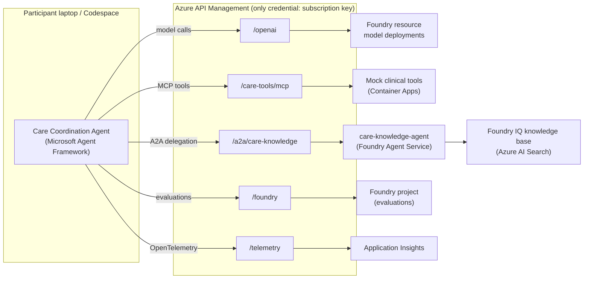

# From Prototype to Proof: Building a Production Agent and Actually Knowing It Works

> **Training use only.** This workshop uses synthetic, fictional data. The Care Coordination Agent is not a medical device and does not provide clinical advice, diagnosis or treatment decisions.

A hands-on workshop lasting **1h45m (105 minutes)**. The time covers both the presenter's concept talks (about 25 minutes, spread between the labs) and the participants' hands-on work.

Standing up an agent prototype takes an afternoon. Everything after that is the actual job, and it's where most agent projects quietly stall. In this hands-on session we build a real agent with the open-source Microsoft Agent Framework. We give it tools through a single managed MCP endpoint, ground it in enterprise knowledge with Foundry IQ, and deploy it to an isolated production runtime. Then we do the part almost nobody demos: we prove it works. We add end-to-end OpenTelemetry tracing across every model call, tool call and sub-agent hop. We define what "good" means with weighted rubrics covering task success, safety, cost and latency. We generate adversarial tests from policy. Finally, we close the loop by turning production traces into ranked, validated improvements with full lineage and rollback.

**Use case:** a Care Coordination Agent for the fictional *Lakeside Regional Health Network*. It helps care coordinators with discharge planning, specialist referrals, follow-up appointment scheduling, medication reconciliation checks and prior-authorization policy questions.

## Repository map

| Folder | Audience | What it contains |
|---|---|---|
| [`infra/`](infra/README.md) | Presenter / admin | Terraform base platform (azurerm + azapi): Foundry resource and project (new model, no hub), model deployments, Azure AI Search and Foundry IQ knowledge base, synthetic care documents, base agent `care-knowledge-agent` with A2A, mock clinical tools on Container Apps, API Management (AI gateway, MCP server, A2A API, Foundry and telemetry proxies), per-participant keys and `.env` files, Azure Monitor workbook, smoke test |
| [`workshop/`](workshop/README.md) | Participants | Python + uv repo: Agent Framework agent, `# TODO (Lab X)` starter code, `solutions/labN` checkpoints, evaluation harness (golden set, weighted rubric, red team from policy), close-the-loop pipeline, self-contained visual lab website and plain-markdown labs |
| [`presenter/`](presenter/README.md) | Presenter | Minute-by-minute run-of-show, slide notes with Mermaid diagrams, pre-flight checklist, Lab 6 and production live-demo script, troubleshooting FAQ, timing cards |
| [`docs/`](docs/) | Everyone | [`CONTRACT.md`](docs/CONTRACT.md) (shared names, routes, headers, data), [`PREVIEW_FEATURES.md`](docs/PREVIEW_FEATURES.md), [`APIM_EXCEPTIONS.md`](docs/APIM_EXCEPTIONS.md) |

## Architecture in one picture



W3C `traceparent` is propagated through APIM, so a single trace shows local agent → APIM → model / MCP tool / A2A base agent → Foundry IQ / AI Search.

## Quick start

**Presenter (the day before):**
```bash
cd infra
cp terraform.tfvars.example terraform.tfvars   # edit prefix, location, models, publisher email
az login
terraform init && terraform apply              # APIM classic tiers can take 30–60 min; v2 tiers are faster
uv run scripts/smoke_test.py --env out/participants/<name>.env
```
Then hand out one `infra/out/participants/<name>.env` per participant (see `infra/README.md`) and work through `presenter/preflight-checklist.md`.

**Participants (prerequisites: VS Code, Git, uv, or use GitHub Codespaces):**

First open [`workshop/guide/index.html`](workshop/guide/index.html) in a browser. The visual guide is
entirely in English and works directly from disk, without a server or installation. It includes detailed
steps for Labs 0–6, copyable commands, checkpoints and browser-local progress. Only running the labs
requires the dependencies and gateway access below.

```bash
cd workshop
uv sync
cp .env.example .env        # paste APIM_BASE_URL, APIM_SUBSCRIPTION_KEY, PARTICIPANT_ID
uv run poe smoke            # Lab 0
uv run poe docs             # optional localhost access to the static guide at http://127.0.0.1:8000
```

## Agenda (105 minutes)

| Clock | Segment |
|---|---|
| 00:00–00:04 | Opening, disclaimer, architecture |
| 00:04–00:09 | Lab 0: Setup and smoke test |
| 00:09–00:26 | Concept + Lab 1: Build the local Care Coordination Agent |
| 00:26–00:38 | Concept + Lab 2: Tools through the managed MCP endpoint |
| 00:38–00:55 | Concept + Lab 3: Multi-agent through A2A |
| 00:55–01:07 | Concept + Lab 4: Observability |
| 01:07–01:30 | Concept + Lab 5: Evaluations |
| 01:30–01:40 | Lab 6: Close the loop (partly a presenter demo) |
| 01:40–01:45 | Wrap-up: "Cheap to change vs. follows you for two years" |

## Ground rules baked into the design

1. **Everything goes through APIM.** Participants never need Azure RBAC, an Azure CLI login or Entra ID credentials. Documented exceptions: [`docs/APIM_EXCEPTIONS.md`](docs/APIM_EXCEPTIONS.md).
2. **New Microsoft Foundry model:** `Microsoft.CognitiveServices/accounts` (kind `AIServices`, `allowProjectManagement = true`) with child `accounts/projects`. No hub, no Machine Learning workspace.
3. **Observability from day one:** tracing, token metrics, LLM logging and a workbook are all provisioned by Terraform.
4. **Pinned versions; preview features are labelled** in code and docs, each with a fallback: [`docs/PREVIEW_FEATURES.md`](docs/PREVIEW_FEATURES.md).
5. **No secrets in git.** Keys only live in git-ignored files and Terraform sensitive outputs.

## Tests

```bash
cd infra && uv run pytest && terraform test                                 # mock backend, docs consistency, policies, naming, plan with mock providers
cd workshop && uv run poe test                                              # offline unit tests, no Azure needed
python3 presenter/scripts/validate_kit.py                                   # timing = 105 min, diagrams, wording
```
