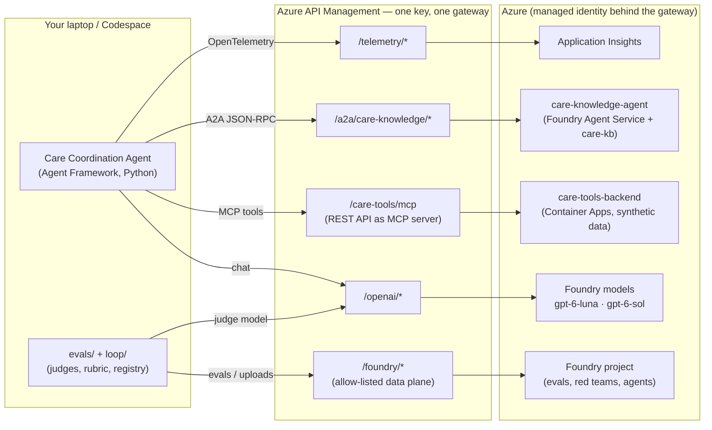

# From Prototype to Proof: Building a Production Agent and Actually Knowing It Works

**Training use only.** This workshop uses synthetic, fictional data. The Care Coordination Agent is not a medical device and does not provide clinical advice, diagnosis or treatment decisions.

**Session length: 1h45m (105 minutes)** — about 80 minutes hands-on, 25 minutes of short concept talks between labs.

## What you build

A **Care Coordination Agent** for the fictional *Lakeside Regional Health Network*. It helps care
coordinators with:

- discharge planning and follow-up scheduling (e.g. cardiology within 7 days for heart failure),
- specialist referrals,
- medication reconciliation **checks** (against a synthetic rule set — never dosing advice),
- prior-authorization policy questions for Northwind Health Plan, Contoso Care Insurance and Fabrikam Mutual Assurance.

And then — the point of the day — you **prove it works**: end-to-end traces, a weighted evaluation rubric
with safety gates, policy-driven red teaming, and a closed loop that proposes, validates, promotes and
rolls back agent versions with full lineage.

## Architecture

Every call leaves your laptop through **one Azure API Management (APIM) gateway**, authenticated with **your
personal subscription key**. You never need an Azure account, `az login` or Entra credentials: APIM calls
the backends with its own managed identity.

## The labs

| Clock | Segment | Minutes |
|---|---|---|
| 00:00–00:04 | Opening, disclaimer, architecture (concept) | 4 |
| 00:04–00:09 | [Lab 0 — Setup & smoke test](lab0.md) | 5 |
| 00:09–00:11 | Concept: agent anatomy & safety boundaries | 2 |
| 00:11–00:26 | [Lab 1 — Build the local Care Coordination Agent](lab1.md) | 15 |
| 00:26–00:28 | Concept: tools behind one managed MCP endpoint | 2 |
| 00:28–00:38 | [Lab 2 — Tools via managed MCP endpoint](lab2.md) | 10 |
| 00:38–00:40 | Concept: A2A and agent contracts | 2 |
| 00:40–00:55 | [Lab 3 — Multi-agent via A2A](lab3.md) | 15 |
| 00:55–00:57 | Concept: trace anatomy | 2 |
| 00:57–01:07 | [Lab 4 — Observability](lab4.md) | 10 |
| 01:07–01:10 | Concept: defining "good" (weighted rubrics) | 3 |
| 01:10–01:30 | [Lab 5 — Evaluations](lab5.md) | 20 |
| 01:30–01:40 | [Lab 6 — Close the loop](lab6.md) (≈4 min presenter demo) | 10 |
| 01:40–01:45 | [Wrap-up: "Cheap to change vs. follows you for two years"](wrap-up.md) | 5 |

!!! checkpoint "Fell behind? That's expected."
    Every lab ends with a checkpoint. `uv run poe catchup <N>` replaces `src/care_agent/` with the
    end-of-lab-N solution and backs up your code in `.catchup_backups/`. Nobody gets left behind.

## Your progress

In the visual guide, check off each lab's steps and final checkpoint. The sidebar and home-page cards
update automatically; optional steps do not block completion. The list below is a summary of the learning outcomes.

- [ ] Lab 0 — all five routes PASS
- [ ] Lab 1 — the agent chats and refuses to diagnose
- [ ] Lab 2 — P-1042 has a cardiology follow-up booked
- [ ] Lab 3 — a policy answer with citations, delegated over A2A
- [ ] Lab 4 — you can read one trace from your laptop to the backend
- [ ] Lab 5 — you have a weighted score, a gate verdict and a red-team attack success rate
- [ ] Lab 6 — you promoted (or rejected!) a candidate version and rolled it back

## Conventions in this guide

!!! concept "Concept"
    Why something works the way it does. Read it while your command runs.

!!! dothis "Do this"
    Follow the numbered steps in your editor and terminal. Copy buttons are on every code block.
    Example output is illustrative: validate the described behavior, not exact timestamps, IDs or model wording.

!!! checkpoint "Checkpoint"
    What you should see before moving on, and how to catch up.

!!! troubleshoot "Troubleshoot"
    The most common failure for this step and its fix. More in [Troubleshooting](troubleshooting.md).

Features marked **Preview** use public-preview Azure capabilities; each has a documented fallback.
