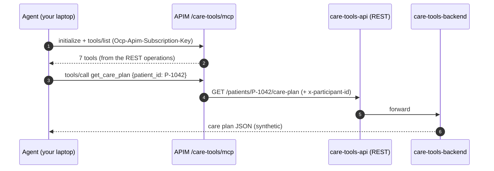
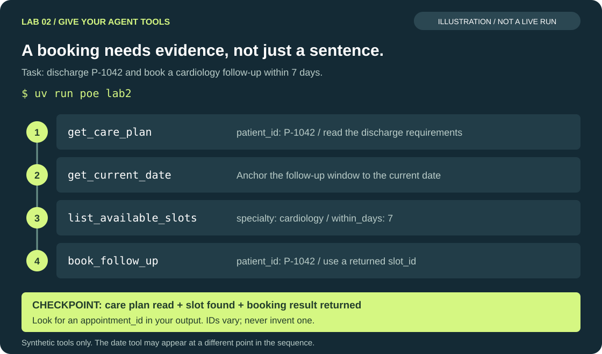

# Lab 2 — Tools via managed MCP endpoint

<span class="lab-timer" data-minutes="10">⏱ 10 min</span> · 00:28–00:38

**Goal:** give the agent real (synthetic) clinical tools through **one** managed MCP endpoint and let it
run a multi-step task: *"Plan discharge for patient P-1042 and book a cardiology follow-up within 7 days."*

!!! concept "Concept: tools behind one managed MCP endpoint"
    The mock clinical system is a plain REST API (`care-tools-api`). APIM publishes it **as an MCP server**
    at `/care-tools/mcp`: every REST operation becomes an MCP tool with the same name.

    | MCP tool | REST operation |
    |---|---|
    | `search_patient` | `GET /patients/search?query=` |
    | `get_care_plan` | `GET /patients/{patient_id}/care-plan` |
    | `list_available_slots` | `GET /slots?specialty=&within_days=` |
    | `book_follow_up` | `POST /appointments` |
    | `create_referral` | `POST /referrals` |
    | `check_medication_interactions` | `POST /medications/interactions` |
    | `check_prior_auth_requirement` | `GET /prior-auth?payer=&procedure_code=` |

    The agent knows *one URL and one key*. Where the backend runs, how it authenticates, rate limits and
    logging are the gateway's job — and can change without touching agent code.



## Steps

**Before you start:** the Lab 1 agent must answer in the CLI. Exit any running chat with `/exit`.
If you are catching up, `uv run poe catchup 1` installs the previous checkpoint and backs up your edits;
it does not complete this lab for you. Run all commands from `workshop/`.

!!! dothis "1. See what is missing"
    ```bash
    uv run poe mcp-tools
    ```
    You get *"This step needs Lab 2 …"*.

!!! dothis "2. Connect the MCP tool"
    Open `src/care_agent/tools_mcp.py`, find `TODO (Lab 2)` in `create_mcp_tool()` and replace the TODO block with:

    ```python
    from agent_framework import MCPStreamableHTTPTool

    return MCPStreamableHTTPTool(
        name="care_tools",
        description="Lakeside care-coordination tools (synthetic data) behind the APIM managed MCP endpoint.",
        url=settings.mcp_url,                     # ${APIM_BASE_URL}/care-tools/mcp
        static_headers=settings.apim_headers(),   # the key is fixed for the process → static headers
        load_prompts=False,                       # APIM MCP servers expose tools only
        request_timeout=30,
    )
    ```

    `agent.py` already adds the tool to the agent when this function returns something.

!!! dothis "3. List the tools"
    ```bash
    uv run poe mcp-tools
    ```
    You should see all 7 tools and `✓ All 7 expected tools are available through APIM.`
    Compare their names with the table above. This proves discovery works before you ask the model to
    choose tools. Save `tools_mcp.py` and retry if you still see the Lab 2 TODO message.

!!! dothis "4. Run the scripted task"
    ```bash
    uv run poe lab2
    ```
    Follow the tool-call table in order: the agent should read P-1042's care plan, find a cardiology slot
    within seven days, and book it. Find the returned `appointment_id`; a sentence saying "booked" without
    a booking result is not sufficient evidence. The date tool may appear at a different point.

!!! dothis "5. Try it yourself"
    `uv run poe chat`, then for example:

    - `Is prior auth needed for an echocardiogram (CARD-ECHO) with Northwind Health Plan?`
    - `Check spironolactone and lisinopril for interactions.`
    - `/tools` — the MCP tools are now listed.

## Expected output

```text
Task: Plan discharge for patient P-1042 and book a cardiology follow-up within 7 days.
                      Tool calls (in order)
┏━━━┳━━━━━━━━━━━━━━━━━━━━━━┳━━━━━━━━━━━━━━━━━━━━━━━━━━━━━━━━━━━━━━━━━━━━━━━━━━━━━━┓
┃ # ┃ Tool                 ┃ Arguments                                            ┃
┡━━━╇━━━━━━━━━━━━━━━━━━━━━━╇━━━━━━━━━━━━━━━━━━━━━━━━━━━━━━━━━━━━━━━━━━━━━━━━━━━━━━┩
│ 1 │ get_care_plan        │ {"patient_id": "P-1042"}                             │
│ 2 │ get_current_date     │ {}                                                   │
│ 3 │ list_available_slots │ {"specialty": "cardiology", "within_days": 7}        │
│ 4 │ book_follow_up       │ {"patient_id": "P-1042", "slot_id": "SLOT-…", …}     │
└───┴──────────────────────┴──────────────────────────────────────────────────────┘
Discharge plan for Jordan Ellis (P-1042) — synthetic data …
─────────────────────────── What you just proved ───────────────────────────
✓ get_care_plan
✓ list_available_slots
✓ book_follow_up
```

Tool timings, slot IDs and wording vary. Use the three checks and the returned booking ID as your evidence.



*Illustrative tool sequence, not a captured run. Verify the real booking result and appointment ID in your output.*

!!! checkpoint "Checkpoint"
    `poe lab2` shows the three ✓ lines and an `appointment_id`. Stuck? `uv run poe catchup 2`.

## Troubleshooting

!!! troubleshoot "MCP handshake failed / 401 on /care-tools/mcp"
    The MCP API expects `Ocp-Apim-Subscription-Key` (not `api-key`). `settings.apim_headers()` sends both —
    make sure you passed `static_headers=settings.apim_headers()`.

!!! troubleshoot "409 when booking"
    Someone (maybe you, in an earlier run) booked that slot. The instructions tell the agent to pick the next
    slot; run the task again.

!!! troubleshoot "The agent books without reading the care plan"
    That is a real finding — keep it! It becomes a failing eval case in Lab 5 and a fix in Lab 6.

## What you just proved

- [ ] The agent orchestrates a multi-step task across tools it discovered at runtime.
- [ ] The agent code contains no backend URL, no backend secret, no REST client — just one MCP endpoint.
- [ ] Tool governance (limits, logging, `x-participant-id`) lives in the gateway, not in every agent.

Next: [Lab 3 — Multi-agent via A2A](lab3.md).
