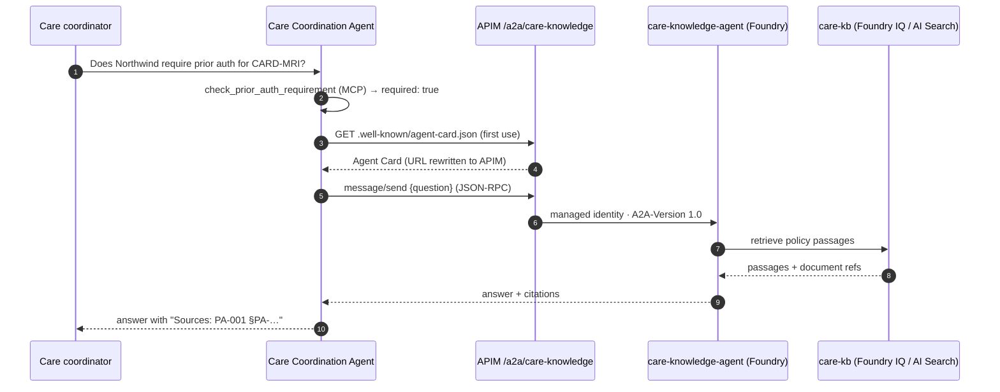

# Lab 3 — Multi-agent via A2A

<span class="lab-timer" data-minutes="15">⏱ 15 min</span> · 00:40–00:55

**Goal:** delegate policy questions to a *different* agent — the base knowledge agent `care-knowledge-agent`
in Foundry Agent Service — over the **A2A** protocol, and surface its citations.

!!! concept "Concept: A2A and agent contracts"
    Your agent owns the **workflow** (patients, slots, bookings). The knowledge agent owns the **policy
    knowledge** (grounded on the `care-kb` knowledge base over 12 synthetic policy documents). They talk
    A2A (JSON-RPC), and the **Agent Card** is their contract: name, description, skills, endpoint URL,
    protocol version and security requirements.

    - APIM publishes the card at `/a2a/care-knowledge/.well-known/agent-card.json`, **rewrites the endpoint
      URL to the gateway** and adds the subscription-key requirement.
    - The remote agent can be re-implemented, re-grounded or moved — as long as the card (the contract)
      stays compatible, your agent does not change.
    - Contracts follow you for years; treat card changes like API versioning.



## Steps

**Before you start:** finish Lab 2 or run `uv run poe catchup 2` (backs up and replaces your agent code).
Exit any open chat, and use the `workshop/` terminal. You will edit two TODO blocks in the same file,
then restart the CLI so it loads the new tool.

!!! dothis "1. Read the contract"
    ```bash
    uv run poe a2a-card
    ```
    Look at `name`, `skills`, the endpoint `url` (it points to APIM, not Foundry) and `securitySchemes`.
    If the card cannot be fetched, resolve that error before editing the client. Do not replace its URL
    with a direct Foundry URL or add Azure credentials.

!!! dothis "2. Connect to the remote agent"
    Open `src/care_agent/a2a_delegate.py`. In `PolicyExpert._connect()` replace the `TODO (Lab 3)` block with:

    ```python
    import httpx
    from agent_framework.a2a import A2AAgent

    # One HTTP client carrying the APIM key for both the card and the JSON-RPC calls.
    self._http = httpx.AsyncClient(timeout=120, headers=self.settings.apim_headers())
    card = await _resolve_card(self._http, self.settings)
    self.card_name = getattr(card, "name", None) or "care-knowledge-agent"
    return A2AAgent(
        name=self.card_name,
        description=getattr(card, "description", None) or "Lakeside policy expert",
        agent_card=card,
        url=self.settings.a2a_base_url,
        http_client=self._http,
    )
    ```

!!! dothis "3. Expose it as a tool"
    In `create_policy_expert_tool()` replace the `TODO (Lab 3)` block with:

    ```python
    expert = PolicyExpert(settings)
    _EXPERTS.append(expert)

    async def ask_policy_expert(
        question: Annotated[str, "A self-contained policy question, including payer and procedure code if relevant."],
    ) -> str:
        """Ask the Lakeside policy expert (remote knowledge agent over A2A) about care pathways,
        prior-authorization policy, referral SLAs and escalation rules. Returns an answer with citations."""
        return await expert.ask(question)

    return ask_policy_expert
    ```

    The docstring **is** the tool description the model sees. Words matter.

!!! dothis "4. Run the delegation"
    ```bash
    uv run poe lab3
    ```
    Confirm the output includes both the `ask_policy_expert` tool call and the remote-agent boundary
    section. Find a document/section citation in the final answer and compare it with the citations
    returned by the remote agent. A fluent policy answer alone is not evidence of delegation.

!!! dothis "5. Chat with both agents"
    `uv run poe chat`, then ask
    `What is the target time frame for an urgent specialist referral, and who has to be notified? Cite the source.`
    Watch for the magenta `A2A → care-knowledge-agent` line with citations.

## Expected output

```text
                        Tool calls (in order)
│ 1 │ check_prior_auth_requirement │ {"payer": "Northwind Health Plan", "procedure_code": "CARD-MRI"} │
│ 2 │ ask_policy_expert            │ {"question": "What does the Northwind prior-authorization …"}  │
Yes — Northwind Health Plan requires prior authorization for CARD-MRI …
Sources: PA-001 §PA-…
──────────────────────── What crossed the A2A boundary ────────────────────────
→ care-knowledge-agent (3120 ms): What does the Northwind prior-authorization policy say …
  citations from the remote agent: PA-001 §PA-…
Citations in the final answer: PA-001 §PA-…
```

This is an example, not a guaranteed transcript. Keep any missing-citation case for the evaluation lab.

!!! checkpoint "Checkpoint"
    `poe lab3` shows an `ask_policy_expert` call and at least one citation. Stuck? `uv run poe catchup 3`.

## Troubleshooting

!!! troubleshoot "`A2A Agent Card not found … (404)`"
    The A2A API or the base agent's A2A endpoint is not enabled (Foundry incoming A2A is **preview**). The
    presenter can switch the gateway to the fallback adapter `care-knowledge-a2a`; your code does not change.

!!! troubleshoot "The agent answers from its own memory instead of delegating"
    Improve the tool docstring or the instructions ("for policy wording … ask the policy expert"). This is
    exactly the kind of failure Lab 5 measures (`groundedness`) and Lab 6 fixes.

!!! troubleshoot "No citations"
    The remote agent answered without sources. The rubric scores this as ungrounded — keep the example.

## What you just proved

- [ ] Two agents built by different teams cooperate through a published contract (the Agent Card).
- [ ] The remote agent's endpoint, identity and grounding are invisible to your code — the gateway mediates.
- [ ] Citations travel across the boundary and are checkable.

Next: [Lab 4 — Observability](lab4.md).
