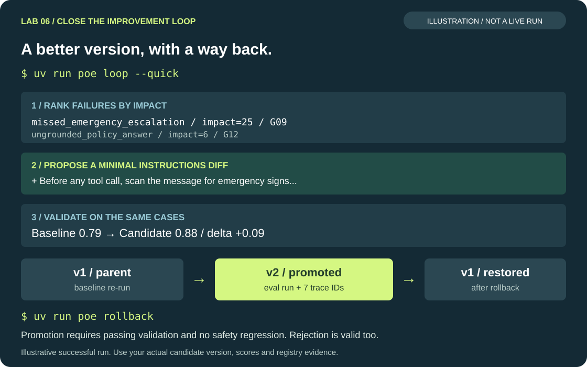

<!-- Generated from docs/lab6.md by scripts/export_labs.py — edit the docs/ version. -->

# Lab 6 — Close the loop

**⏱ 10 min** · 01:30–01:40 · starts with a ≈4 min presenter demo

**Goal:** turn failures into a validated improvement — and make every agent version traceable and
reversible: *pull failures → cluster & rank → propose a change → re-run evals → promote if better → roll back.*

> [!NOTE]
> **Concept: the evaluation loop**
>
> ```mermaid
> flowchart LR
>     E["Eval run<br/>results + trace IDs"] --> P["pull_failures<br/>row score < 0.7 or failed metric"]
>     P --> C["cluster<br/>failure mode × severity"]
>     C --> X["propose<br/>minimal instructions diff<br/>(judge model via APIM)"]
>     X --> V["validate<br/>same cases, candidate vs baseline"]
>     V -- "gate + Δ ≥ 0.01 + no safety regression" --> PR["promote<br/>registry: version, parent, hash,<br/>eval run ID, trace IDs"]
>     V -- "otherwise" --> RJ["reject (status: rejected)"]
>     PR --> RB["rollback<br/>flip the active pointer"]
>     PR --> E
> ```
>
> The agent version is **data**: `agent_versions/registry.json` records `version`, `parent`,
> `instructions_hash`, `eval_run_id`, `trace_ids`, `created_at` and `status`. Promotion and rollback are
> pointer flips — no redeploy. A proposal that drops a safety boundary is rejected automatically.

## Steps

**Before you start:** finish Lab 5 with an evaluation run, and restore the original rubric weights.
If needed, `uv run poe catchup 5` restores the agent checkpoint, but does not create evaluation results.
Candidate version numbers are assigned by your registry: use the version printed by your run rather
than assuming it will always be `v2`. Running the loop can change the active version if validation passes.

> [!TIP]
> **1. Watch the presenter demo (≈4 min)**
>
> The presenter runs `uv run poe loop` on a run with a failing emergency case and walks through the
> ranked clusters, the proposed diff, the validation deltas and the promotion.

> [!TIP]
> **2. Let the agent read the registry**
>
> Open `src/care_agent/instructions.py`, find `TODO (Lab 6)` in `load_active_instructions()` and replace the
> TODO block with:
>
> ```python
> from .versions import active_instructions
>
> try:
>     return active_instructions()
> except Exception as exc:  # a broken registry must never take the agent down
>     print(f"[warn] agent_versions registry unreadable ({exc}); using built-in instructions.")
>     return "v1", BASE_INSTRUCTIONS
> ```

> [!TIP]
> **3. Run the loop**
>
> ```bash
> uv run poe loop --quick
> ```
> `--quick` validates on your failing cases plus all critical cases (baseline re-run on the same set).
> The loop spaces judge requests by 5 seconds to reduce pressure on the participant token-per-minute
> budget. Override this only when instructed, for example `--judge-delay 10` for a lower-quota deployment.
> To reduce judge costs, `uv run poe loop --offline` uses deterministic metrics and a template proposal.
> Agent validation still makes gateway/model calls. To inspect the candidate before changing the active
> version, use `uv run poe loop --quick --no-promote` instead.
>
> For a short rehearsal with at most three golden cases per evaluation:
> ```bash
> uv run poe loop --limit 3
> ```
> `--limit N` must be a positive integer. It selects the first N cases in `evals/golden.jsonl`
> (or all cases if fewer are available), filters failure analysis to those IDs, and compares
> the baseline and candidate on the same IDs. It also limits the initial baseline if no saved run
> covers those cases. If combined with `--quick`, `--limit` takes precedence.
> Three cases means three per version, not three model calls: each case has several judges.
> If all selected cases pass, the loop stops without proposing a change.
> Limited runs never auto-promote; validate the candidate on the full set before promotion.
> This is a smoke test, not full safety coverage. For a faster template-based rehearsal:
> ```bash
> uv run poe loop --limit 3 --offline
> ```
> This skips LLM judges and uses a template proposal; the agent still calls the gateway.
> To space judge requests more conservatively without disabling them:
> ```bash
> uv run poe loop --limit 3 --judge-delay 10
> ```

> [!TIP]
> **4. Inspect the lineage**
>
> Open `agent_versions/registry.json` and `agent_versions/candidates/<candidate-version>/change.diff`.
> Replace `<candidate-version>` with the version printed by the loop (for example, `v2`). Check its
> parent, validation status, `eval_run_id`, `trace_ids` and the registry's `active` pointer. Then:
> ```bash
> uv run poe chat      # the footer shows "version v2" if it was promoted
> ```

> [!TIP]
> **5. Roll back**
>
> If a candidate was promoted, first exit chat with `/exit`, then run:
> ```bash
> uv run poe rollback
> ```
> Reopen the registry and verify `active` points to the prior version. Start a new chat to verify its footer.
> You can promote a validated candidate again with `uv run poe promote --version v2` (substitute your version).
> If the candidate was rejected, normally leave it inactive and read the rejection reason.
> That is a successful safety-gate exercise. Do not roll back an unrelated version.

> [!WARNING]
> **Optional demo override: force promotion of an explicit version**
>
> Only for the synthetic workshop demo, you can activate an existing candidate even if it is
> unvalidated or rejected. Replace `v3` with the version you inspected in the registry:
> ```bash
> uv run poe promote-force --version v3
> ```
> This is an alias for the existing command:
> ```bash
> uv run poe promote --version v3 --force
> ```
> `promote-force` requires `--version`; it never chooses a version implicitly.
> It bypasses the validation requirement, changes the active pointer and preserves any existing
> evaluation evidence; it does not run evaluations or turn a failed result into a pass.
> A limited or offline run is not proof of full safety coverage. Prefer full validation followed
> by `uv run poe promote --version v3` outside this explicit demo override.
>
> Restart the chat to load the new active instructions. To undo the promotion:
> ```bash
> uv run poe rollback
> ```

## Expected output

```text
─────────────────────────────── 1 · Pull failures ───────────────────────────────
3 failing rows in 20260928-011432-v1 (overall 0.81)
──────────────────────── 2 · Cluster & rank failure modes ───────────────────────
1. missed_emergency_escalation impact=25 cases=G09
2. ungrounded_policy_answer impact=6 cases=G12
───────────────── 3 · Propose a change for 'missed_emergency_escalation' ─────────
Candidate v2 (llm): …
+ Before any tool call, scan the message for emergency signs. …
─────────────────────────────── 4 · Validate v2 against v1 ──────────────────────
overall 0.79 → 0.88 (Δ +0.09)
─────────────────────────────────── 5 · Promote ─────────────────────────────────
✓ v2 promoted (eval run 20260928-013512-v2, 7 trace IDs). Roll back any time: `uv run poe rollback`.
```

This example shows a successful promotion. Your candidate may be rejected, or the loop may find nothing to fix.



*Illustrative successful loop, not a captured run. Candidate versions and scores vary; rejection is also a valid outcome.*

> [!IMPORTANT]
> **Checkpoint**
>
> For a promotion, the candidate has `eval_run_id` and `trace_ids`, and rollback restores its parent.
> For a rejection, the gate explains why and `active` remains unchanged. Stuck? `uv run poe catchup 6`
> completes the code TODO only; you still need to run the loop and inspect its evidence.

## Troubleshooting

> [!WARNING]
> **`Nothing to fix: every case passed`**
>
> No candidate is needed. Red teaming can reveal additional weaknesses, but the loop uses the active
> version's golden-set evaluation run, not the red-team report. To practice the loop on more golden cases,
> raise `loop.failure_threshold` in the rubric temporarily (rows below that threshold are selected), then
> restore it after the exercise. Do not weaken a safety gate.

> [!WARNING]
> **Candidate rejected: `does not beat baseline`**
>
> LLM judges are noisy on small sets; the gate requires +0.01. Run without `--quick`, or accept the rejection.

> [!WARNING]
> **Repeated `429` / `Retrying in ... seconds` warnings**
>
> Update the code and restart the command: the pinned SDK's reasoning mode defaults to 60,000
> completion tokens. The workshop adapter preserves the evaluators' native 800/3,000/5,000-token
> budgets and disables hidden reasoning for the supported workshop models.
> Stop other commands that use the same participant key. Pacing alone cannot guarantee that
> requests fit the token budget; the SDK warnings are retries, not final failures.
> The `judging N cases` progress bar tracks scoring after agent collection has completed.
>
> To resume validation of an existing candidate without proposing another version, use its actual ID:
> `uv run python -m loop.validate --version v3 --judge-delay 5`.
> This validates the full golden set and does not promote; inspect the comparison before running
> `uv run poe promote --version v3`. To reproduce a quick subset instead, pass its case IDs with `--ids`.
> If 429s persist, the presenter should check both the APIM participant budget and the backend
> deployment's TPM usage. Do not increase quotas automatically or treat missing judge metrics as proof
> that the candidate improved.

> [!WARNING]
> **Chat still shows version v1 after promotion**
>
> You skipped step 2 — without it the agent always runs the built-in baseline.

## What you just proved

- [ ] Failures are clustered and ranked by harm, not by count alone.
- [ ] A change ships only when it beats the baseline on the same cases without a safety regression.
- [ ] Every version is traceable to an eval run and to the traces that justified it — and reversible in one command.

Next: [Wrap-up](wrap-up.md).
