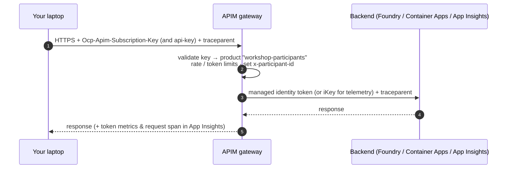

<!-- Generated from docs/setup.md by scripts/export_labs.py — edit the docs/ version. -->

# Setup

> [!CAUTION]
> **Training use only.** This workshop uses synthetic, fictional data. The Care Coordination Agent is not a medical device and does not provide clinical advice, diagnosis or treatment decisions.

Do this **before** the session if you can (10 minutes). Lab 0 then takes 5.

## Prerequisites

You need three tools. Nothing else: uv installs Python 3.12 for you, and you need **no** Azure account.

| Tool | Why | Check |
|---|---|---|
| VS Code | editor, debugger configs, recommended extensions | `code --version` |
| Git | clone the repo | `git --version` |
| uv | installs Python 3.12 and the pinned dependencies | `uv --version` |

**macOS / Linux**


```bash
curl -LsSf https://astral.sh/uv/install.sh | sh
```

**Windows (PowerShell)**


```powershell
powershell -ExecutionPolicy ByPass -c "irm https://astral.sh/uv/install.ps1 | iex"
```

**Homebrew / winget**


```bash
brew install uv            # macOS
winget install --id=astral-sh.uv -e   # Windows
```

> [!NOTE]
> **Zero-install alternative: Codespaces / Dev Container**
>
> Open the repository in **GitHub Codespaces** (Code → Codespaces → Create) or in VS Code with the
> **Dev Containers** extension (*Reopen in Container*). `.devcontainer/devcontainer.json` installs uv,
> runs `uv sync` and the recommended extensions. Create `.env` inside the container as below.
> Port 8000 (docs) and 8080 (DevUI) are forwarded automatically.

## Get the code

```bash
git clone <repo-url>
```

Replace `<repo-url>` with the repository URL supplied by the presenter. In VS Code, open the cloned
repository's `workshop/` folder and choose **Terminal > New Terminal**, then run:

```bash
uv sync
```

`uv sync` reads `.python-version` (3.12), downloads Python if needed, creates `.venv/` and installs the
exact versions pinned in `pyproject.toml` (plus the `dev` and `docs` groups).

## Your three values

You receive a participant card with three values. Copy the example file and paste them in:

**macOS / Linux**


```bash
cp .env.example .env
code .env
```

**Windows (PowerShell)**


```powershell
Copy-Item .env.example .env
code .env
```

```dotenv
APIM_BASE_URL=https://<apim-name>.azure-api.net
APIM_SUBSCRIPTION_KEY=<your-personal-key>
PARTICIPANT_ID=user07
```

> [!WARNING]
> **Never commit `.env`**
>
> `.env` is git-ignored. Your key is personal, rate-limited, and revoked after the session. If you ever
> paste it somewhere public, tell the presenter — they can regenerate it in seconds.

Everything else is **derived** (`src/care_agent/config.py`): the OpenAI endpoint, the MCP URL, the Agent Card
URL, the Foundry project endpoint and the Application Insights connection string (fetched once from
`GET ${APIM_BASE_URL}/telemetry/config`). You can override any derived value in `.env` — see
[Reference](reference.md).

## How a request flows



## VS Code

Open the `workshop/` folder. Accept the recommended extensions (Python, Pylance, Ruff, Mermaid preview,
Even Better TOML; AI Toolkit optional). Then:

- **Run and Debug** has configurations for *Chat*, *Lab 2*, *Lab 3*, *Evals* and *Tests*.
- **Terminal → Run Task…** wraps every `poe` command (smoke, chat, evals, docs, catch-up …).

## Open the visual lab guide

Open `workshop/guide/index.html` in your browser, for example by double-clicking it in your file manager.
You do **not** need Python, uv, a server or an internet connection to read the guide.
The workshop commands themselves still require the environment and gateway access described above.

The home page links to all seven labs. Check off each step and the final checkpoint to track your progress.
Optional steps do not block lab completion. Progress is stored only in your current browser; moving the
file, switching browsers or clearing browser data may reset it. No keys or lab results are stored by the guide.
If browser storage is blocked, the guide displays a notice and keeps checkmarks for the current visit.

Code blocks have a **Copy** button. If your browser blocks clipboard access for local files, the code is
selected instead: press **Ctrl+C** (Windows/Linux) or **Command+C** (macOS). **Print / PDF** prints the current page.
To clear checkmarks deliberately, use **Reset progress** in the sidebar.

If you prefer localhost (or are using Codespaces), optionally run from `workshop/`:

```bash
uv run poe docs     # http://127.0.0.1:8000
```

This serves the same prebuilt static file; it does not watch for source changes.

Next: [Lab 0 — Setup & smoke test](lab0.md).
